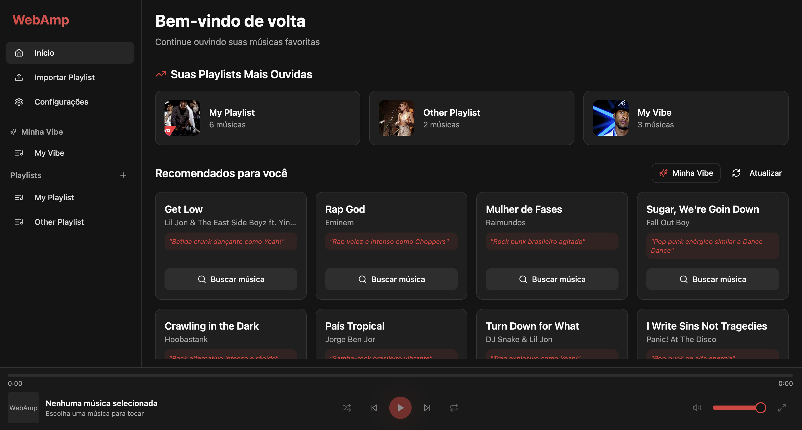
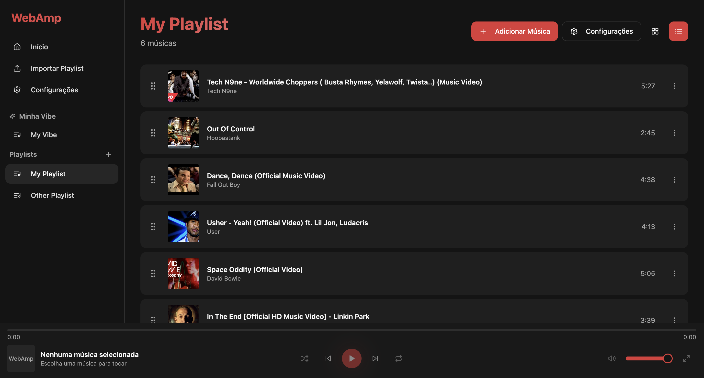
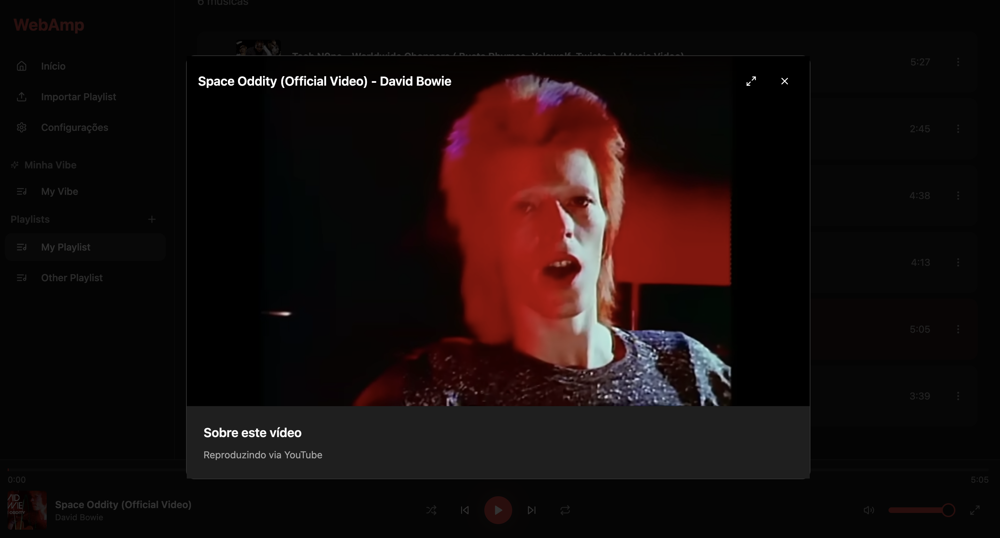
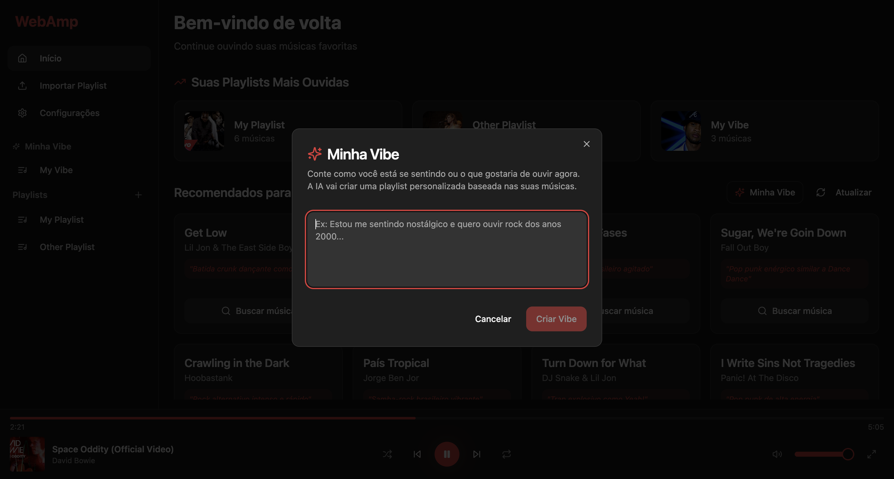

# WebAmp 🎵



WebAmp is a modern web application for music and video streaming, built with React, TypeScript, and Vite. With a sleek and responsive interface, it allows you to create playlists, import collections, and watch YouTube videos in an integrated player.

## ✨ Features

- **Playlist Management**: Create, edit, and delete your own playlists.
- **Persistent Player**: Keep listening to your music while navigating the app.
- **Video Mode**: Expand the player to watch music videos in full screen or theater mode.
- **Smart Import**: Import playlists via JSON or external URL.
- **Drag & Drop**: Reorder your songs by simply dragging and dropping.
- **Keyboard Shortcuts**: Control playback (Play/Pause, Next, Previous) with configurable shortcuts.
- **Vibe Mode**: Automatically generated playlists for different moods.
- **Modern Interface**: Clean and responsive design using Tailwind CSS and shadcn/ui.

## 🚀 Technologies

- [React](https://react.dev/)
- [TypeScript](https://www.typescriptlang.org/)
- [Vite](https://vitejs.dev/)
- [Tailwind CSS](https://tailwindcss.com/)
- [shadcn/ui](https://ui.shadcn.com/)
- [React Router](https://reactrouter.com/)
- [TanStack Query](https://tanstack.com/query/latest)
- [Hello Pangea DnD](https://github.com/hello-pangea/dnd)

## 📸 Screenshots

### Player and Playlist



### Video Mode



### My Vibe



## 🛠️ Installation and Local Setup

Follow the steps below to run the project on your machine:

### Prerequisites

- Node.js (version 18 or higher)
- Yarn (package manager)

### Step by Step

1. **Clone the repository**

```bash
git clone https://github.com/victorheringer/web-amp.git
cd web-amp
```

2. **Install dependencies**

```bash
yarn install
```

3. **Start the development server**

```bash
yarn dev
```

4. **Access the application**

Open your browser and go to `http://localhost:8080` (or the port indicated in the terminal).

## 🤝 Contribution

Contributions are welcome! Feel free to open issues or submit pull requests.

---

Developed with ❤️ by Victor Heringer
